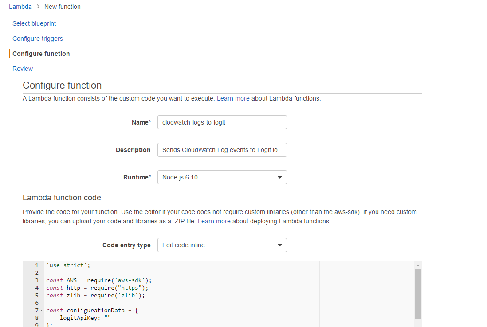
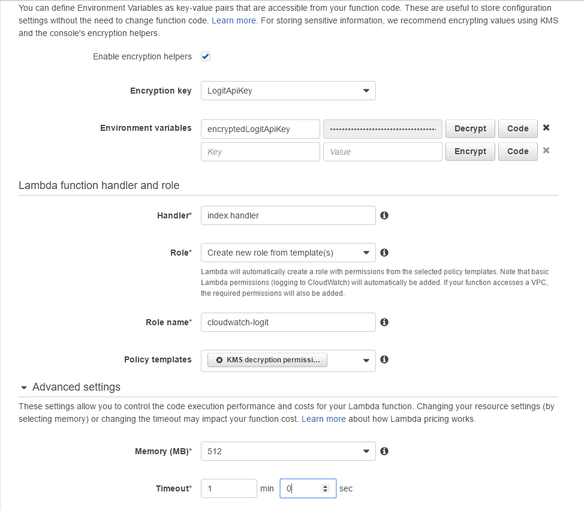
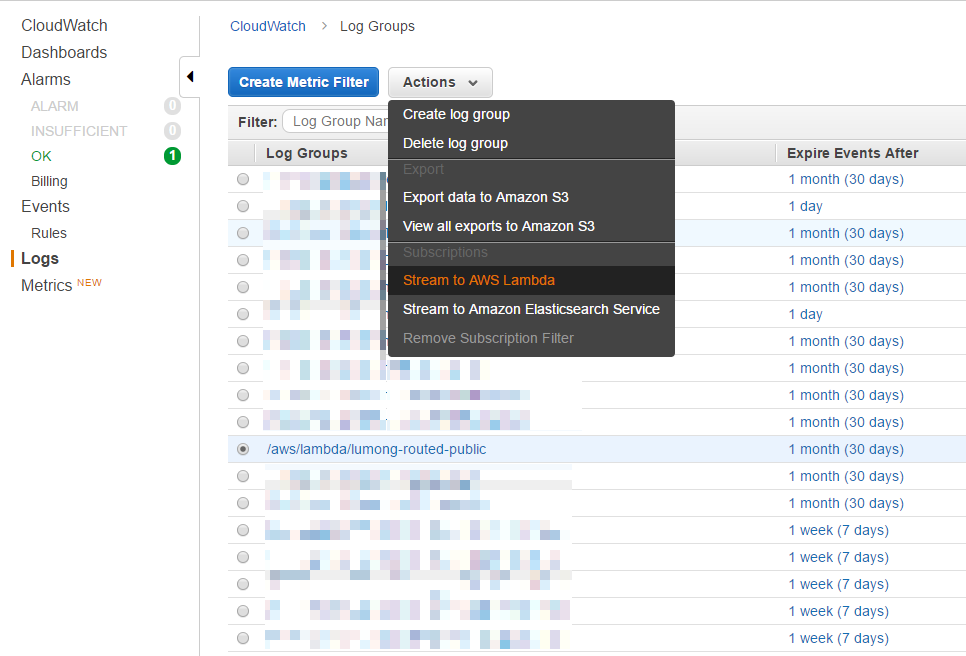
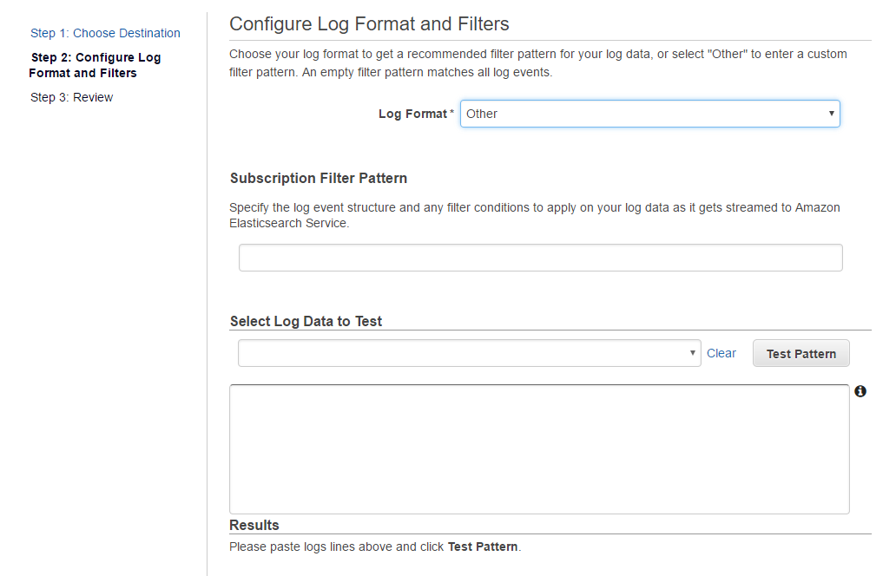

# CloudWatch Logs to Logit.io

Small Node.js based AWS Lambda function to ship CloudWatch Logs to
[Logit.io](https://logit.io), a hosted ELK provider.

## Usage

This solution uses a [Node.js](https://nodejs.org/en/) based [AWS Lambda](https://aws.amazon.com/lambda/) function,
and the streaming functionality in [Amazon CloudWatch Logs](https://docs.aws.amazon.com/AmazonCloudWatch/latest/logs/WhatIsCloudWatchLogs.html).

### Prerequisites

In case you want to use your own KMS key to encrypt the Logit.io API Key (recommended), create a key
to be used in the *AWS IAM Management Console*. Make sure the key is in the same region as your lambda
will be.

### Create the Lambda function

Open the *Lambda Management Console* (in *Services* menu, under *Compute*) and click on `Create a Lambda function`.
Skip to the `Configure function` step of the wizard, fill in **Name** and select **Node.js 6.X** as the **Runtime**. 
Copy the code from this repository's `lambda/lambda.js` file to the editor.

If you want to use your own KMS key to encrypt the Logit.io API key you need to provide, check **Enable encryption helpers**,
select your **Encryption key** and create an **Environment variable** with the name `encryptedLogitApiKey` and use your 
Logit.io API key as the value. Press the **Encrypt** button next to the key-value pair.

If you don't want to use your own KMS key, then create an **Environment variable** with the name `logitApiKey` and use your 
Logit.io API key as the value. 

For **Role** select **Create new role from template(s)**, give your role a name, and add **KMS decryption permissions** to
your **Policy templates**. 

In **Advanced settings** select **Memory (MB)** value **512** and the **Timeout** to **1 min**. 

Click **Next**, check your settings one more time and then click **Create function**. 

### Setup Logstash filters

Before we start streaming the log messages to Logit.io, we need to set-up the Logstash filters that will understand 
the JSON message sent by the Lambda function we created above (btw: the Lambda function will use the 
[HTTP transport](https://docs.logit.io/sending-logs/http/) to ship the log messages to Logit.io.).

+ `logstash_conf/logstash_cloudwatch_logs_basic.conf` is a minimal filter configuration that can do the job. 
+ `logstash_conf/logstash_cloudwatch_logs_lambda.conf` is a configuration that works well if you are streaming
log entries created by other Lambda functions. It extracts useful fields such as *duration* and *billed duration*. 
+ `logstash_conf/logstash_cloudwatch_logs_lambda_extended.conf` extends the above mentioned configuration with 
a format we use internally at Oulumo Oy.

### Stream CloudWatch Logs entries

Open *CloudWatch Management Console* and select the *Logs* entry in the sidebar. Select the **Log Group** you want to stream
to Logit.io, then select **Stream to AWS Lambda**.

On the **Lambda Function** step of the wizard, select the Lambda function you created above. On the 
**Configure Log Format and Filters** step, select **Log Format** value **Other**, and leave the 
**Subscription Filter Pattern** field empty (this is needed to send all the log entries to Logit.io).

Click **Next**, check your settings one more time and then click **Start Streaming**.

## License

See the [LICENSE](LICENSE.md) file for license rights and limitations (MIT).